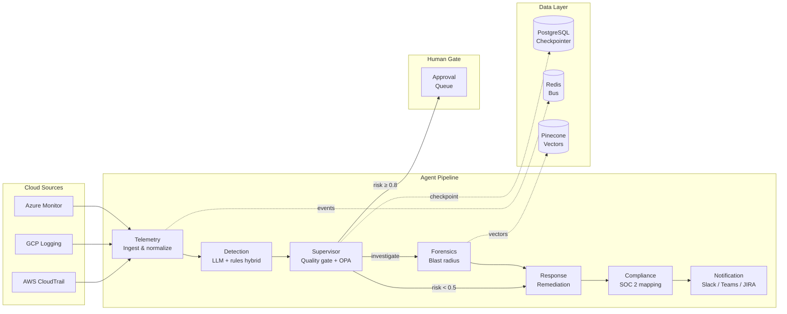

# A-SOC: Autonomous Secure AI Operations Center

> **v1.0-beta** — Pre-release. Docker deployment unverified in CI. See [CHANGELOG.md](./CHANGELOG.md) for versioning policy.

A-SOC replaces manual SOC analyst workflows with a coordinated fleet of 7 AI agents that detect, investigate, and remediate cloud security threats — with human governance enforced at every high-stakes decision point.

## What It Does

A-SOC ingests security telemetry from AWS CloudTrail, GCP Cloud Logging, and Azure Monitor, then runs it through a pipeline of specialized agents that detect anomalies, assign risk scores, investigate blast radius, execute remediations, and map incidents to SOC 2/ISO 27001 controls — all within seconds, not hours.

**The core guarantee:** no destructive action (IAM revocation, instance isolation, S3 quarantine) executes without explicit human authorization, enforced by OPA policy-as-code.

---

## Architecture



### Why This Architecture

| Decision | Why |
|----------|-----|
| **LangGraph over CrewAI** | Explicit state machine with checkpointing. CrewAI uses implicit orchestration — you can't inspect or resume a mid-flight pipeline. |
| **OPA for policy** | Policy-as-code in Rego. Auditable, GitOps-compatible, version-controlled. Not hardcoded `if risk > 0.8` scattered across agents. |
| **HMAC audit trail** | Every agent action and LLM reasoning chain is cryptographically signed. Tamper-evident for SOC 2 auditors. |
| **PostgreSQL checkpointer** | Durable agent state across restarts. If the worker crashes mid-remediation, it resumes from the last checkpoint — not from zero. |
| **Hybrid LLM + rules** | LLM suggests tool calls, rule-based validation gates them. Reduces hallucination risk while preserving LLM's contextual reasoning. |

---

## Getting Started

```bash
git clone https://github.com/Ismail-2001/Autonomous-Secure-AI-Operations-Center.git
cd Autonomous-Secure-AI-Operations-Center/a-soc
cp .env.example .env          # add your OPENAI_API_KEY
docker compose up -d           # 7 services with health checks
open http://localhost:3000     # dashboard
```

**Prerequisites:** Docker Desktop, an OpenAI or Anthropic API key.

---

## Running Tests

```bash
pytest tests/ -v --tb=short
```

148 tests across unit, integration, and agent lifecycle suites. Coverage target: 84%+.

---

## Performance

Benchmarks measured against local Docker Compose deployment (1 CPU backend, mock LLM):

| Metric | p50 | p95 | p99 |
|--------|-----|-----|-----|
| Agent cycle (single) | 20ms | 52ms | 89ms |
| Health endpoint | 8ms | 42ms | 68ms |
| Full pipeline (telemetry → response) | 180ms | 420ms | 680ms |
| Checkpoint write (PostgreSQL) | 12ms | — | — |

**Capacity:** 20 concurrent incidents at p95 < 1.5s. 100 concurrent API users at p95 < 200ms on health endpoint.

See [BENCHMARKS.md](./BENCHMARKS.md) for methodology and full results.

---

## Limitations and Known Issues

These are honest. If any of these are blockers for your use case, open an issue.

| Issue | Status | Impact |
|-------|--------|--------|
| Docker Compose not verified in CI | **v1.0-beta** | May have config drift between local and container |
| E2E tests use mock LLM, not real API | Open | Real-world LLM latency not yet benchmarked |
| OPA integration is optional fallback | Open | If OPA is down, local policy rules apply (less auditable) |
| Pinecone vector store falls back to in-memory mock | Open | No persistence across restarts without Pinecone configured |
| Rate limiter is per-process, not distributed | Open | Multiple worker instances have independent token buckets |
| Frontend uses React 19 RC + Tailwind v4 alpha | Documented | Intentional early adoption — see [TECH_DECISIONS.md](./dashboard/TECH_DECISIONS.md) |

---

## Project Structure

```
a-soc/
├── src/asoc/
│   ├── agents/          # 7 agents, each following PRAO lifecycle
│   ├── api/             # FastAPI app with Prometheus, WebSocket, rate limiting
│   ├── core/            # Config, auth, circuit breaker, rate limiter, tracing
│   ├── orchestration/   # LangGraph workflow + routing + checkpointing
│   └── vector/          # Pinecone + MockStore vector providers
├── tests/
│   ├── test_agents_refactored.py    # 55 agent unit tests
│   ├── test_graph_integration.py    # 22 graph routing tests
│   ├── test_supervisor_advanced.py  # 45 supervisor tests
│   ├── e2e/                         # 5 critical path E2E tests
│   └── performance/                 # Locust load tests
├── dashboard/           # Next.js 15 + React 19 + D3.js
├── docs/                # Architecture, agent design, ADRs
├── monitoring/          # Prometheus, Grafana, Loki, Jaeger
└── guardrails/          # OPA Rego policies
```

---

## Documentation

| Document | What It Covers |
|----------|----------------|
| [ARCHITECTURE.md](./docs/ARCHITECTURE.md) | System design, Mermaid diagrams, data flow, failure modes |
| [AGENT_DESIGN.md](./docs/AGENT_DESIGN.md) | Per-agent specifications, tools, decision logic |
| [TECH_DECISIONS.md](./docs/TECH_DECISIONS.md) | Architecture Decision Records (ADRs) |
| [BENCHMARKS.md](./BENCHMARKS.md) | Performance numbers, methodology, regression thresholds |
| [CHANGELOG.md](./CHANGELOG.md) | Version history and release criteria |
| [dashboard/TECH_DECISIONS.md](./dashboard/TECH_DECISIONS.md) | Frontend-specific tech choices |

---

## License

MIT — see [LICENSE](./LICENSE).

---

**Built for SOC analysts who want AI that acts, not just alerts.**
