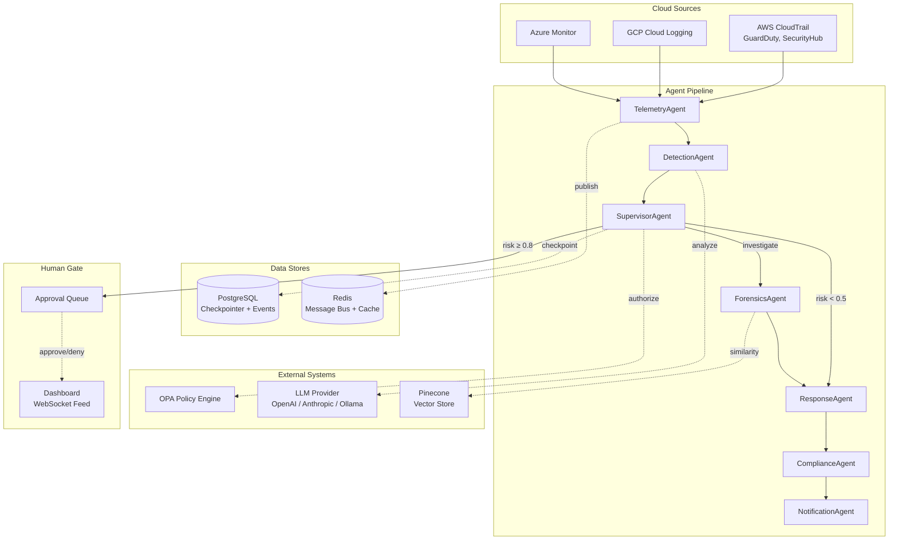
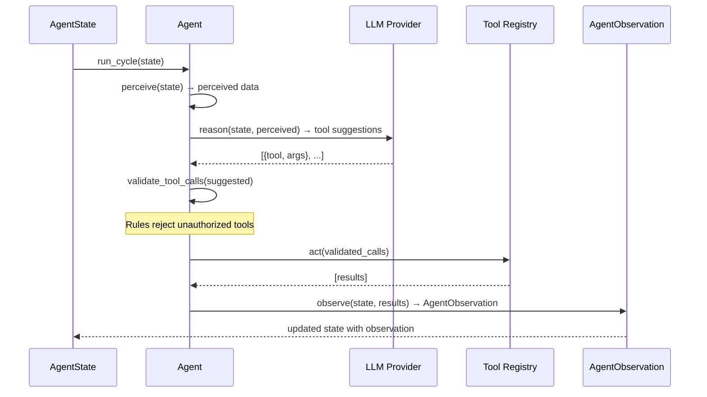
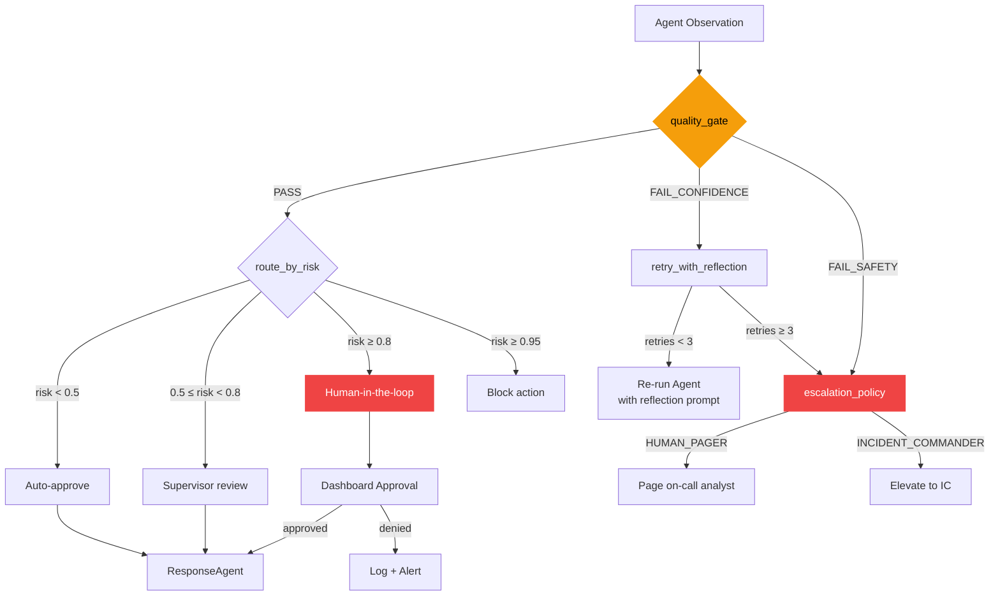
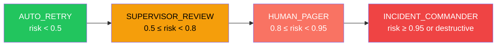
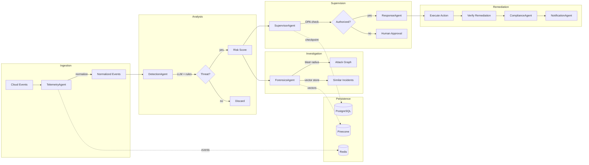
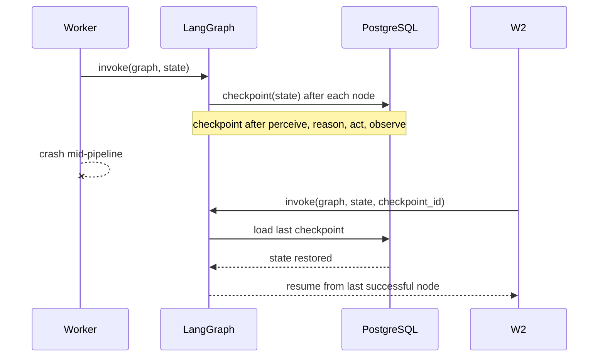
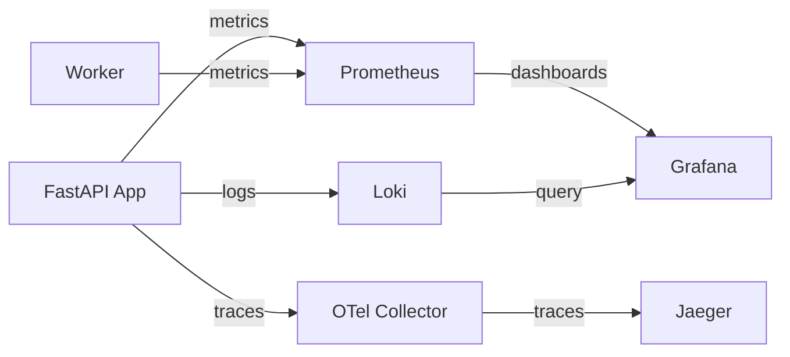

# Architecture

This document describes A-SOC's system design, data flow, and failure modes. All diagrams use Mermaid and render on GitHub.

---

## System Overview

A-SOC is a multi-agent security operations platform. A central Supervisor agent orchestrates 6 specialist agents through a LangGraph state machine. Every agent follows the Perceive-Reason-Act-Observe (PRAO) lifecycle and emits structured `AgentObservation` objects.

---

## Agent Lifecycle (PRAO)

Every agent executes the same four-phase cycle:

---

## Supervisor Agent Architecture

The Supervisor is the orchestrator. It doesn't just route — it validates quality, retries failed agents with reflection, and escalates when confidence is low.

### Quality Gate Thresholds

| Agent | Min Confidence | Required Fields |
|-------|---------------|-----------------|
| DetectionAgent | 0.6 | `risk_score`, `reasoning` |
| ForensicsAgent | 0.5 | `root_cause`, `blast_radius` |
| ResponseAgent | 0.9 | `success`, `action` |
| ComplianceAgent | 0.7 | `mapped_controls` |
| TelemetryAgent | 0.7 | `event_count` |
| NotificationAgent | 0.8 | `sent_count` |
| SupervisorAgent | 0.8 | — |

### Escalation Levels

---

## Data Flow

---

## Checkpoint Strategy

A-SOC uses LangGraph's `AsyncPostgresSaver` for durable agent memory. If a worker crashes mid-incident, the pipeline resumes from the last checkpoint — not from zero.

### Fallback

If PostgreSQL is unavailable, `MemorySaver` (in-memory) is used automatically. State is lost on restart but the system remains functional.

---

## Failure Modes

| Failure | Detection | Recovery |
|---------|-----------|----------|
| LLM API timeout | `async_retry` with 3 attempts | Falls back to `MockProvider` |
| OPA unreachable | HTTP error from `httpx` | Local policy rules apply |
| PostgreSQL down | Health check `pg_isready` | `MemorySaver` fallback |
| Redis down | `redis-cli ping` health check | Message bus unavailable; agents continue with local state |
| Agent quality gate fail | Confidence < threshold | `retry_with_reflection` (up to 3 attempts) |
| Worker crash | Docker restart policy | Resumes from last PostgreSQL checkpoint |
| High-risk action proposed | Escalation policy | Human-in-the-loop approval queue |

---

## Observability

- **Prometheus**: Request latency, error rates, circuit breaker states
- **Jaeger**: Distributed traces across agent pipeline
- **Grafana**: Pre-built dashboards for agent health, pipeline throughput
- **LangSmith**: LLM call tracing via `@traceable` decorators on all agent methods
